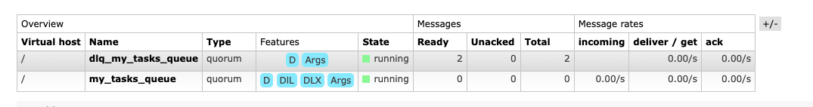

# POC celery + Rabbit
Projeto com objetivo para testar a integração celery + rabbit para s=publish subscriber.

## Depdendencias:
- pyhton 3.11
- pipenv. Este projeto utiliza pipenv(https://pipenv.pypa.io/en/latest/) como gerenciador de dependencias. 
Para instalar o Pipenv
```shell
pip install pipenv
```

Após é executar:
```shell
pipenv install
```

## Arquivos principais
- app : aplicação flask para publicar mensagem
- worker : aplicaçãoque fica escutando fila para processar as mensagens


## executando
Este projeto possui um arquivo docker-compose que inicia o rabbit, aplicação worker(consumidora) e um publisher escrito com Flask.
para exeuctar é necessário apenas executar o comando :
```shell
docker-compose up --build
```

## Testando

A aplicação para publicar iniciará na no endereço http://127.0.0.1:5000. 
### Testando mensagem de sucesso
O endereço http://127.0.0.1:5000/newmessage publicará uma mensagem por topico que será consumida pela fila que o worker estará atuando:

## Logs exemplos:
```
Connected to amqp://admin:**@rabbitmq:5672//
2023-09-05T14:03:32.225804622Z 172.26.0.1 - - [05/Sep/2023 14:03:32] "GET / HTTP/1.1" 200 -
2023-09-05T14:03:37.079825081Z 172.26.0.1 - - [05/Sep/2023 14:03:37] "GET /newmessage HTTP/1.1" 200 -
2023-09-05T14:03:37.097838886Z Got task: hello_task('Kombu')
```

### Testando mensagem com erro que cai em deadletter
O endereço http://127.0.0.1:5000/newmessage?value=<valor diferente de Kombu> publicará uma mensagem por topico que será consumida pela fila que o worker estará atuando. COmo a mensagem terá problemas ocorrerão dez tentativas de processamento e a mensagem será enviada para a fila deadletter.

Ex: 
- Executar endereço http://127.0.0.1:5000/newmessage?value=abacate

```
Received abacate
Received abacate
Received abacate
Received abacate
Received abacate
Received abacate
Received abacate
Received abacate
Received abacate
Got task: hello_task('abacate')
Got task: hello_task('abacate')
Got task: hello_task('abacate')
```
E na fila do RabbitMQ ficará assim:




## Utilizando o Decorator implementado com  biblioteca Hijiki
Foi implementado um exemplo de decorator utilizando o worker do Celery/Kombu, de forma a simplificar a implementação da aplicação:

Para isto deve-se inicializar o core de controle na aplicação passando unma listagem de que identifica fila e exchanges associados:
```python
    qs = [HijikiQueueExchange('teste1', 'teste1_event'), HijikiQueueExchange('teste2', 'teste2_event')]
    gr = HijikiRabbit().with_queues_exchange(qs).with_username("rabbitmq") \
        .with_password("rabbitmq") \
        .with_host("localhost") \
        .with_port(5672) \
        .build()
```
Este processo ira criar as estruturas de filas de dados e Deadletters e seus respectivos Exchanges.

Em seguida é necessário apenas decorar uma função python que execute alguma ação baseado no evento.

```python
    @gr.task(queue_name='teste1')
    def meu_consumidor(data):
        print(f"consumidor1 executado com mensagem sendo: {data}")
```

Esta implementação suporta apenas serializador json como corpo da mensagem.
o fonte  worker_decorated.py possui uma implementação exemplo.

### Testando mensagem para o decorator
O endereço http://127.0.0.1:5000/publish_message publicará uma mensagem que cairá no decorator que implementa a fila teste1. No log será apresentado:

```
consumidor1 executado
```

Esta implementação esta disponivel na biblioteca Hikiji, 
https://pypi.org/project/hijiki/#history

e 

https://github.com/asengardeon/hijiki

### Publicando uma mensagem
Para publicar uma mensagem com o uso da biblioteca Hijiki, pode-se utilizar o código abaixo:

```python
    pub = Publisher("localhost", "rabbitmq", "rabbitmq", 5672)
    pub.publish_message('teste1_event', '{"value": "Esta é a mensagem"}')
```

Este objeto Publisher faz o uso das configurações de conexão passada para as configurações da biblioteca e publica uma mensagem no BROKER.

